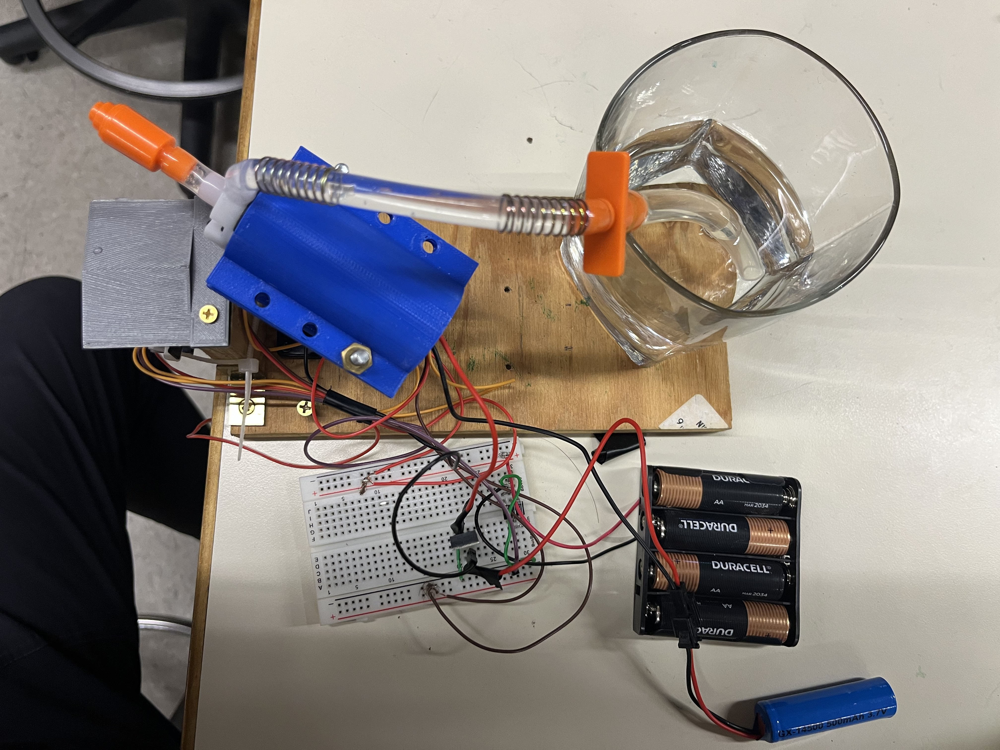

# cat-deterrent
## Intro
This project is effectively a water gun turret designed to track and shoot onjects with water. Ideally, we want to detect cats with the [OpenMv Camera](https://openmv.io/).

## Physical System
The system built for this project is composed a pan/tilt platform with a 3d printed mount water pump taken from a watergun.

## Use
You will need the [OpenMV IDE](https://openmv.io/pages/download) to upload to the camera via USB connection.
'''
- 'system_test.py' is a program to ensure all the functions of the physical system. 

- 'final_demo.py' is the program that tracks the object and triggers the water gun
'''
Adjust parameters such as threshold_lab, intial water velocity, and any nessesary offsets in distance,pan, or tilt for the desired object in your desired enviroment.

## Slightly more in depth overview and operation 
While intializing, a green LED will be on. During this intialzation, the OpenMV cameria will take a picutre of its enviroment and store this image to memory as a reference. Comparing the regernce image to what is currently in view, if an object is in view the code will look for blobs that are within the thresholds set. When a blob within the thresholds is detect and is within range of the turret, the waterun will aim and fire water at the desired target. A red LED on-board will be lit up while htis is happening. If an oject is in view of the camera but not in range of the turret,(that is below where the turret can aim) the turret will not fire and blue on-board LED will flash.

The 3-D printed parts used are found in hte stl_parts folder.

A detailed report is found in the report.pdf

The following are some photos of the system

